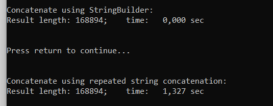
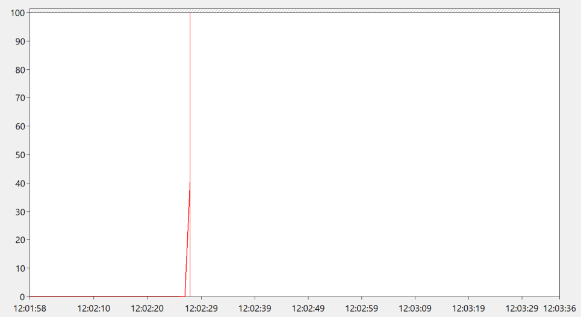
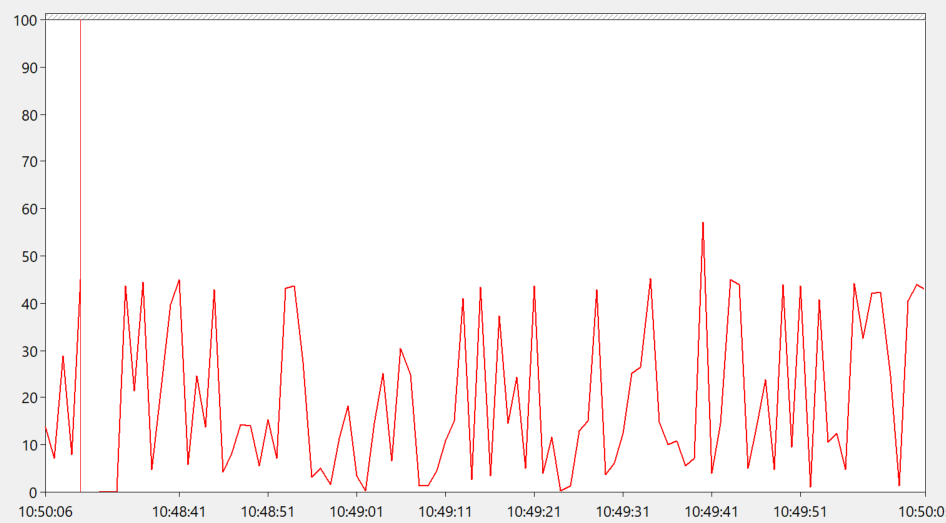

## Exercise 9.1
The byte code instructions with comments explaining them can be found in the file `Selsort.il` for dotnet and in 
`Selsort.jvmbytecode` for java.

## Excercise 9.2
### 9.2.1
This shows the execution times for string concatenation with and without a stringbuilder. 
Clearly the one with a stringbuilder is much faster. This is due to string concatenations without a stringbuilder,
using O(N) time for a single concatenation (N being the length of the resulting string).

### 9.2.2
This picture shows the garbage collection time in percentage for StringConcatSpeed. We can see that at the end of the 
execution the percentage goes all the way up to about 40 %. This is due to strings being immutable, which means the 
naive string concatenation needs to copy it self a lot. This leaves the old strings to be garbage collected.

### Excercise 9.2.3
We implement a stack using a resizing array. Specifically, everytime the array is full, and a new element gets pushed,
a new array is created, that is double the size of the old array, and all the elements are copied over to the new array.
This leaves the old array to be garbage collected. Similarly if an element is popped and the amount of elements in 
the stacked now is half than the size of the array, a new array is created being half the size of the old array.

We test the stack by pushing and popping a large number of elements in the stack, leading to a lot of resizing. 
This leads to a lot of old arrays that needs to be garbage collected.
The stack implementation can be found in the file BadStack.cs. The main method testing the stack can be found in 
the file TestClass.cs.

The image below shows the monitoring of the garbage collection.

